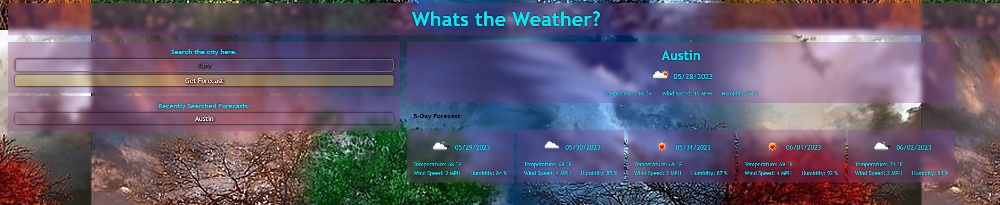

# Weather6

## Description
This application uses a weather api to fetch your weather data so you can get the current temperature!
## Table of Contents

- [Usage](#usage)
- [Credits](#credits)
- [Features](#features)
- [License](#license)

## Usage

Deployed Link: https://lindseyisaac.github.io/Weather6/
## Credits
Peer Consultation: 
***M Vincent Richards*** 
***Matt Montiel***
***Danny Cohen*** 
***Jacqueline Martinez*** 
## Features
This application on the left has a search bar for you to find the weather for the area that you need it will then display the 5 day forecast.
## License
MIT License

Copyright (c) 2023 Lindsey